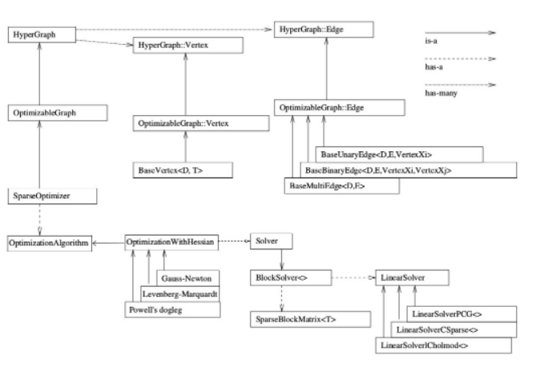

# slam notes

- [常用开源方案](https://github.com/liuqian62/notebook/tree/main/slamNotes/slam%E5%BC%80%E6%BA%90%E6%96%B9%E6%A1%88)

## slam 后端一般分为两种处理方法
* 扩展卡尔曼滤波（滤波方法）
* 图优化（非线性优化方法）

## 图优化
1. 构建图。机器人位姿作为顶点，位姿间关系作为边。
2. 优化图。调整机器人的位姿（顶点）来尽量满足边的约束，使得误差最小。
# 如何使用g2o（General Graphic Optimization）
- [参考链接](https://mp.weixin.qq.com/s/j9h9lT14jCu-VvEPHQhtBw)
- [参考链接](https://www.cnblogs.com/CV-life/p/10449028.html)
- [参考链接](https://www.cnblogs.com/CV-life/archive/2019/03/13/10525579.html)

* 图的核心


* 顶点和边
* 配置SparseOptimizer的优化算法和求解器
* 如何求解

## 分步骤实现

```cpp
typedef g2o::BlockSolver< g2o::BlockSolverTraits<3,1> > Block;  // 每个误差项优化变量维度为3，误差值维度为1

// 第1步：创建一个线性求解器LinearSolver
Block::LinearSolverType* linearSolver = new g2o::LinearSolverDense<Block::PoseMatrixType>(); 

// 第2步：创建BlockSolver。并用上面定义的线性求解器初始化
Block* solver_ptr = new Block( linearSolver );      

// 第3步：创建总求解器solver。并从GN, LM, DogLeg 中选一个，再用上述块求解器BlockSolver初始化
g2o::OptimizationAlgorithmLevenberg* solver = new g2o::OptimizationAlgorithmLevenberg( solver_ptr );

// 第4步：创建终极大boss 稀疏优化器（SparseOptimizer）
g2o::SparseOptimizer optimizer;     // 图模型
optimizer.setAlgorithm( solver );   // 设置求解器
optimizer.setVerbose( true );       // 打开调试输出

// 第5步：定义图的顶点和边。并添加到SparseOptimizer中
CurveFittingVertex* v = new CurveFittingVertex(); //往图中增加顶点
v->setEstimate( Eigen::Vector3d(0,0,0) );
v->setId(0);
optimizer.addVertex( v );
for ( int i=0; i<N; i++ )    // 往图中增加边
{
  CurveFittingEdge* edge = new CurveFittingEdge( x_data[i] );
  edge->setId(i);
  edge->setVertex( 0, v );                // 设置连接的顶点
  edge->setMeasurement( y_data[i] );      // 观测数值
  edge->setInformation( Eigen::Matrix<double,1,1>::Identity()*1/(w_sigma*w_sigma) ); // 信息矩阵：协方差矩阵之逆
  optimizer.addEdge( edge );
}

// 第6步：设置优化参数，开始执行优化
optimizer.initializeOptimization();
optimizer.optimize(100);
```

## 创建一个线性求解器LinearSolver
## 创建BlockSovler。并用上面的定义的线性求解器初始化
## 创建总和求解器solver。并从GN, LM, DogLeg 中选一个，再用上述块求解器BlockSolver初始化
## 创建终极大boss 稀疏优化器（SparseOptimizer），并用已定义求解器作为求解方法
## 定义图的顶点和边。并添加到SparseOptimizer中

### 重写四个函数
* virtual bool read(std::istream& is);
* virtual bool write(std::ostream& os) const;
* virtual void oplusImpl(const number_t* update);

顶点更新函数。非常重要的一个函数，主要用于优化过程中增量△x 的计算。我们根据增量方程计算出增量之后，就是通过这个函数对估计值进行调整的，因此这个函数的内容一定要重视。
* virtual void setToOriginImpl();

顶点重置函数，设定被优化变量的原始值。
## 设置优化参数，开始执行优化
